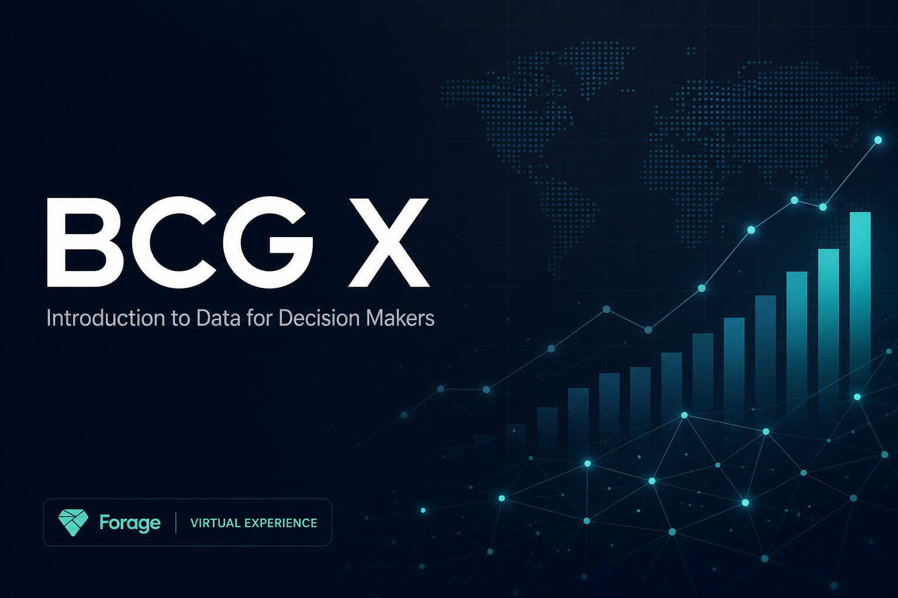

<div align="center">

# 📊 BCG X – Introduction to Data for Decision Makers

### Marketing Analytics Consulting Simulation

Turning campaign data into strategic business recommendations through data analysis, customer segmentation, and data storytelling.

<br>


---



</div>

---

# Executive Summary

Marketing teams invest significant budgets across multiple advertising channels, but knowing **where to invest next** is often far more difficult than measuring past performance.

As part of the **BCG X – Introduction to Data for Decision Makers** virtual job simulation on **Forage**, I worked as a **Marketing Analytics Consultant** advising a fictional consumer goods company on its digital marketing strategy.

Using Microsoft Excel, I analyzed campaign performance across multiple marketing channels, compared customer acquisition trends, and translated analytical findings into a concise business recommendation.

The objective was not simply to identify the highest-performing campaign—but to determine which strategy best supported the client's primary business goal:

> **Growing new customer sales.**

---

# The Business Problem

The client recently launched two marketing campaigns across three digital marketing channels.

Although performance data was available, stakeholders lacked a clear understanding of:

- Which campaign generated the strongest business value.
- Which marketing channel performed best.
- Whether new and existing customers responded differently.
- Which campaign deserved additional marketing investment.

Rather than maximizing short-term revenue, the company's strategic objective was to **acquire more new customers**.

This meant the analysis needed to focus on business value—not simply the largest sales numbers.

---

# My Role

Acting as a **Marketing Analytics Consultant**, I was responsible for transforming campaign data into actionable business recommendations.

My responsibilities included:

- Exploring campaign performance using Excel.
- Analyzing customer conversion trends.
- Comparing campaign effectiveness across marketing channels.
- Segmenting new and existing customers.
- Identifying meaningful business insights.
- Presenting findings through executive-ready visualizations.
- Delivering a data-backed recommendation aligned with the client's goals.

---

# Project Objectives

The analysis aimed to answer one central business question:

> **Which campaign and marketing channel should the client prioritize to maximize new customer growth?**

To answer this question, I focused on four objectives:

- Evaluate campaign performance across all marketing channels.
- Compare new customer versus existing customer behaviour.
- Identify the strongest-performing campaign-channel combination.
- Deliver a clear recommendation supported by analytical evidence.

---

# Project Workflow

```text
                       Marketing Campaign Dataset
                                   │
                                   ▼
                      Data Exploration & Cleaning
                                   │
                                   ▼
                  Pivot Tables & Performance Analysis
                                   │
                                   ▼
                Campaign & Channel Performance Comparison
                                   │
                                   ▼
              Customer Segmentation Analysis
              (New Customers vs Existing Customers)
                                   │
                                   ▼
                     Business Insight Generation
                                   │
                                   ▼
                  Executive Recommendation Slide
                                   │
                                   ▼
                   Client-Ready Business Decision
```

---

# Project Preview

## Campaign Performance Analysis

<p align="center">

</p>

---

## Executive Recommendation

<p align="center">

</p>

---

# Task 1 — Data Analysis

The first stage of the simulation focused on understanding campaign performance through structured data analysis.

Using Microsoft Excel, I explored campaign results across different marketing channels while comparing how new and existing customers responded to each campaign.

Rather than stopping at total revenue, I applied customer segmentation to uncover insights directly aligned with the client's business objective.

The analysis included:

- Campaign performance by marketing channel
- Customer segmentation analysis
- Revenue comparison
- Conversion trend evaluation
- Pivot Tables
- Pivot Charts
- Business hypothesis testing

This phase demonstrated how changing the analytical perspective can significantly alter business conclusions.

---

# Task 2 — Communicating Findings

Data creates value only when decision-makers understand it.

The second phase focused on transforming analytical findings into an executive-ready recommendation suitable for business stakeholders.

The deliverable included:

- Clear executive summary
- Supporting charts
- Business insights
- Strategic recommendation
- Actionable next steps

Rather than overwhelming stakeholders with numbers, the goal was to communicate a recommendation that could confidently guide future marketing investments.

---

# Key Business Insights

Several important insights emerged during the analysis.

### 📧 Email generated the strongest overall revenue.

Email consistently outperformed Instagram and Web Banner in total sales, making it the strongest-performing marketing channel overall.

---

### 💰 Campaign B generated the highest overall sales.

At first glance, Campaign B appeared to be the obvious choice because it produced the highest total revenue across all customer groups.

---

### 👥 Customer segmentation changed the conclusion.

When analysis focused exclusively on **new customers**, the results shifted considerably.

Email combined with **Campaign A** consistently produced stronger new customer sales than any other campaign-channel combination.

---

### 🎯 Business objectives matter.

The highest revenue campaign was **not** the best recommendation because the client's priority was customer acquisition rather than short-term revenue.

---

# Final Recommendation

After evaluating campaign performance against the client's objectives, I recommended prioritizing:

# 📧 Email + Campaign A

Although Campaign B generated stronger overall revenue, Campaign A proved more effective at acquiring new customers—the company's primary strategic objective.

I also recommended continuing controlled A/B testing on future email campaigns to further optimize customer acquisition performance while maintaining a data-driven marketing strategy.

---

# Repository Structure

```text
bcg-data-for-decision-makers
│
├── README.md
├── LICENSE
│
├── assets
│   ├── project-banner.png
│   ├── task1-preview.png
│   ├── recommendation-slide.png
│   ├── workflow.png
│   └── certificate.png
│
├── Task 1 - Data Analysis
│   ├── Campaign Data.xlsx
│   ├── My Analysis.xlsx
│   ├── Example Answer.xlsx
│   └── screenshots
│
├── Task 2 - Communicating Findings
│   ├── Recommendation Slide.pptx
│   ├── My Recommendation.pdf
│   ├── Example Answer.pdf
│   └── screenshots
│
├── Certificate
│   └── BCG X Certificate.pdf
│
└── docs
    ├── Project Timeline.md
    └── Lessons Learned.md
```

---

# Deliverables

This repository includes:

- Original simulation resources
- Completed Excel analysis
- Pivot Tables and Pivot Charts
- Recommendation presentation
- Supporting documentation
- Completion certificate

Together, these files document the complete analytical workflow—from raw campaign data to executive-level business recommendations.

---

# Lessons Learned

Completing this simulation reinforced several important lessons that extend beyond Excel and marketing analytics.

### Business context drives analysis.

The most valuable insight is not always the highest number. Understanding the client's objective is essential before drawing conclusions from data.

### Customer segmentation reveals hidden opportunities.

Analyzing new and existing customers separately uncovered patterns that would have been missed using overall sales alone.

### Communication is part of analytics.

Producing accurate analysis is only one part of the job. Communicating insights clearly is equally important for enabling effective business decisions.

### Data supports strategy.

Successful analysts do more than report metrics—they translate data into recommendations that help organizations make confident decisions.

---

# Certificate

<p align="center">


</p>

Successfully completed the **BCG X – Introduction to Data for Decision Makers** Virtual Job Simulation hosted on **Forage**, gaining practical experience in marketing analytics, campaign performance evaluation, customer segmentation, and business communication.

---

# Why This Project Matters

Although this project is based on a simulated client engagement, the analytical workflow reflects how marketing analytics teams approach campaign evaluation in real organizations.

The project demonstrates the ability to:

- Analyze business data
- Interpret customer behaviour
- Generate actionable insights
- Communicate recommendations to stakeholders

These are transferable skills used across consulting, business intelligence, marketing analytics, and analytics engineering roles.

---

# Connect With Me

🌐 **Portfolio**  
https://your-portfolio.vercel.app

💼 **LinkedIn**  
https://linkedin.com/in/your-profile

💻 **GitHub**  
https://github.com/your-username

📧 **Email**  
your@email.com

---

<div align="center">

### Thank you for visiting!

If you found this project interesting, consider exploring my other repositories covering **Data Analytics**, **Business Intelligence**, and **Data Engineering**.

⭐ If you enjoyed this project, consider giving it a star.

</div>
